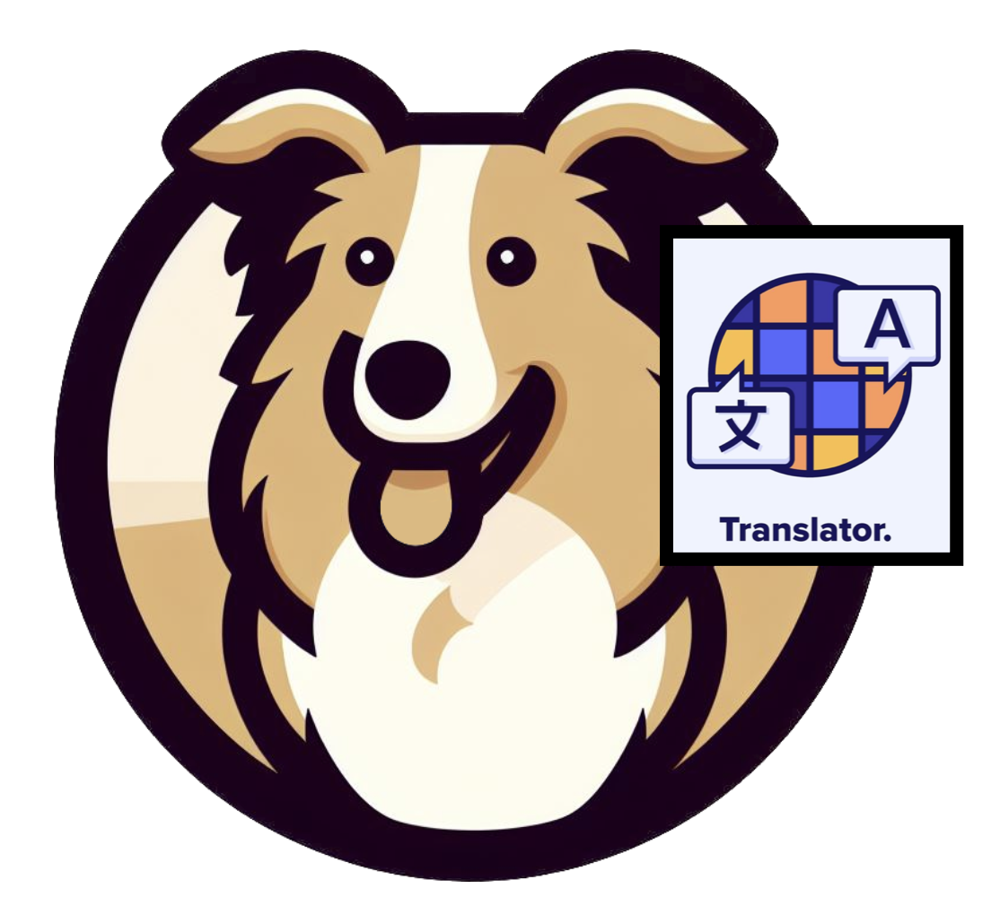
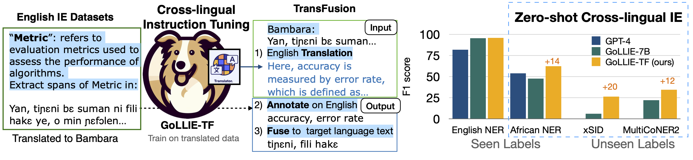
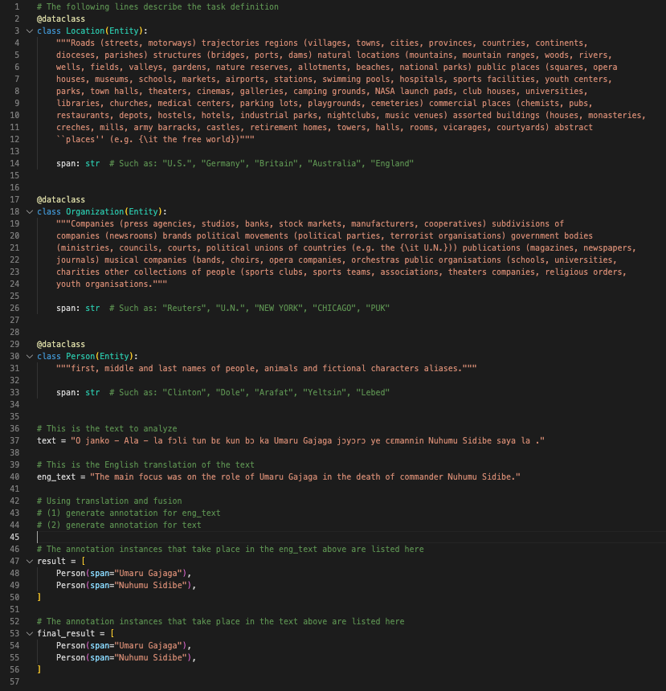

<p align="center">
    <br>
    
    <br>
    <h2 align="center">GoLLIE-TF: Translation and Fusion Improves Zero-shot Cross-lingual Information Extraction


<p align="center">
    <a href="https://github.com/hitz-zentroa/GoLLIE/blob/main/LICENSE"></a>
    <a href="https://huggingface.co/ychenNLP/GoLLIE-7B-TF"></a>
    <a href="https://arxiv.org/abs/2305.13582"></a>
</p>

## Summary
We propose TransFusion, a framework in which models are fine-tuned to use English translations of low-resource language data, enabling more precise predictions through annotation fusion. 
Based on TransFusion, we introduce GoLLIE-TF, a cross-lingual instruction-tuned LLM for IE tasks, designed to close the performance gap between high and low-resource languages.

- 📖 Paper: [Translation and Fusion Improves Zero-shot Cross-lingual Information Extraction](https://arxiv.org/abs/2305.13582)
- 🤗 Model: [GoLLIE-7B-TF](https://huggingface.co/ychenNLP/GoLLIE-7B-TF)
- 🚀 Example Jupyter Notebooks: [GoLLIE-TF Notebooks](notebooks/tf.ipynb)
</p>

<p align="center">

</p>


## Schema definition and inference example

The labels are represented as Python classes, and the guidelines or instructions are introduced as docstrings.
<p align="center">

</p>

## Installation

You will need to install the following dependencies to run the GoLLIE codebase:
```bash
Pytorch >= 2.0.0 | https://pytorch.org/get-started
We recommend that you install the 2.1.0 version or newer, as it includes important bug fixes.

transformers >= 4.33.1
pip install --upgrade transformers

PEFT >= 0.4.0
pip install --upgrade peft

bitsandbytes >= 0.40.0
pip install --upgrade bitsandbytes

Flash Attention 2.0
pip install flash-attn --no-build-isolation
pip install git+https://github.com/HazyResearch/flash-attention.git#subdirectory=csrc/rotary
```

You will also need these dependencies
```bash
pip install numpy black Jinja2 tqdm rich psutil datasets ruff wandb fschat
```
<!-- 
## Pretrained models
We release three GoLLIE models based on [CODE-LLama](https://huggingface.co/codellama) (7B, 13B, and 34B). The models are available in the 🤗HuggingFace Hub.

| Model | Supervised average F1 | Zero-shot average F1 |                     🤗HuggingFace Hub                     |
|---|:---------------------:|:--------------------:|:---------------------------------------------------------:|
| GoLLIE-7B |         73.0          |         55.3         |  [HiTZ/GoLLIE-7B](https://huggingface.co/HiTZ/GoLLIE-7B)  | -->


## Continue Training GoLLIE for TransFusion

First, we initialize the model from GoLLIE-7B. Then we set up training data path in gollie-tf.yaml (dataset_ep_dir:). A copy of the data can be found in [link](https://drive.google.com/drive/folders/1AmN02h0TSwgBCjkIjZiaMFwJSxKzObJE).

Second, we continue train the model on English and TransFusion data using QLoRA. Cehck bash_scripts/run_training.sh

```bash
CONFIGS_FOLDER="configs/model_configs"
python3 -m src.run ${CONFIGS_FOLDER}/gollie-tf.yaml
```

Finally, we run inference by loading lora weights and merging it with the GoLLIE-7B. Check bash_scripts/run_inference.sh. A copy of the processed test data can be found in [link](https://drive.google.com/drive/folders/1_qHM9R4HJT0DIZ68z4himb1M7fnYu8h4).
```bash
python3 -m src.hf_inference --dataset_path $DATASET_PATH --task_name_list $DATASET_NAME --num_size $NUM_SIZE --output_path $OUTPUT_PATH --batch_size 8 --model_name $MODEL_NAME
```

## Encoder-based TransFusion

Please check code at [edchengg/transfusion](https://github.com/edchengg/transfusion) for multilingual BERT based transfusion experiment.


## Citation


```bibtex
@article{chen2023better,
  title={Translation and Fusion Improves Zero-shot Cross-lingual Information Extraction},
  author={Chen, Yang and Shah, Vedaant and Ritter, Alan},
  journal={arXiv preprint arXiv:2305.13582},
  year={2023}
}
```

## Acknolwedgement
This material is based in part on research sponsored by IARPA via the BETTER program (2019-19051600004).

The GoLLIE-TF codebase is adopted from the [GoLLIE](https://github.com/hitz-zentroa/GoLLIE) project. We appreciate authors discussion on model implementation. We extend the codebase by adding multilingual IE evaluation tasks and extend dataset class. Please cite GoLLIE as well if you use the model.